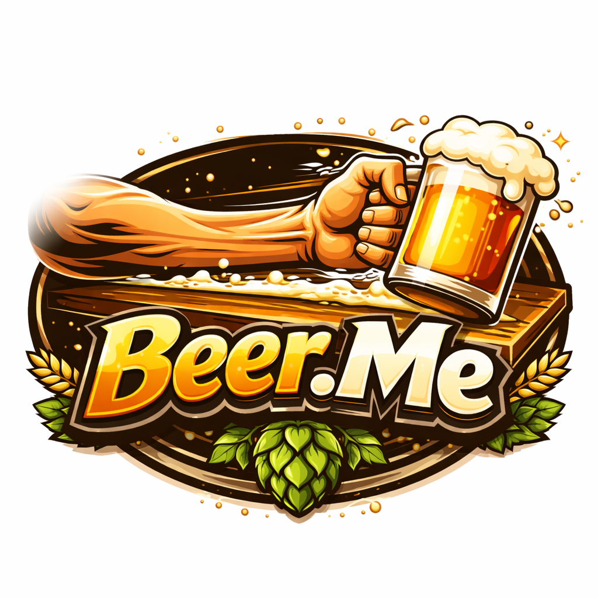

  

<!-- Link to the App: [Beer.Me Application Link](NEED LINK) -->

# Beer.Me

The perfect app for finding the freshest, crispiest, hoppiest beer in your area!

<!-- [Landing page of the Beer.Me App](NEED GUI PIC) -->

**Description**

* Beer.Me is an app where users can post and track beers that they have consumed from establishments in their local area. If knowledge is power then our app will empower our users to know where the freshest, crispiest, and cheapest beers are
in their neighborhoods.

* Users can create posts for beers that they have consumed or view beers from other users on the app. If a user's memory was *altered* while creating a post, users can update or delete any post that they have created.

* Beer.me does not take any legal responsibility from employers, significant others, or family members seeing the numnber of beers that you have been drinking.

# Background Info

* We chose to create this application as all three developers have the same thing in common....our love of beer! By knowing which bars/ restaurants are serving overpriced, stale/ skunk beer and which were serving the nectar of the gods, we could adjust our bar-hopping locales accordingly.

<!-- [Beer.Me ERD](NEED ERD PIC) -->

# Technologies Used

* React, JavaScript, HTML, CSS, VS Code, EJS, Node.js, Express.js, Mongoose, MongoDB, and AWS. Also, credit to OpenAI for generating the Beer.Me logo and helping me debug some roadblocks during the coding process.

# Attributions

* 

# Next Steps/ Stretch Goals

* The next steps for the app....
