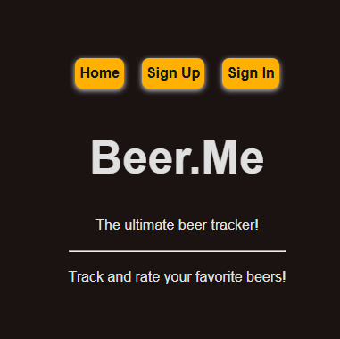

# 🍺 Beer.Me

The perfect app for tracking and rating your favorite beers in your area!

## 📖 Description

Beer.Me is a full-stack MERN application that allows users to log, rate, and track beers they’ve consumed at local bars and restaurants.

Users can:
- Create an account and securely log in
- Post beers they’ve tried
- View all beers in their personal “Beer Cabinet”
- View detailed information about a specific beer they've added
- Edit or delete beers they’ve posted
- Browse other users’ beer cabinets
- Add locations where they've had beers, including how many and how much
- Edit or delete locations where they've posted

_Beer.Me does not take legal responsibility for employers, significant others, family members, or any others seeing the number of beers you’ve logged._

---

## 🧠 Background

We created Beer.Me because all three developers share one thing in common — a love of beer.

We wanted a simple way to remember:
- Which bars served the nectar of the gods 🍺
- Which ones charged too much
- Which ones were serving suspiciously skunky drafts

Beer.Me helps users make better bar-hopping decisions based on real experiences.

---

## 🚀 Getting Started

### 🔗 Deployed App
[Click here to use Beer.Me](https://main.d1yyzdi58s6yy8.amplifyapp.com/)

### 📋 Planning Materials
- [Trello Board](https://trello.com/b/4XK2wD6W)
- [ERD](https://dbdiagram.io/d/Beer-Me-6986660bbd82f5fce2efd18c)
- [Wireframes (Found on Trello Board)](https://trello.com/b/4XK2wD6W)

### 🛠 Back-End Repository
[Back-End GitHub Repo](https://github.com/Gitty398/beer.me-backend)

---

## 🧰 Technologies Used

### Frontend
- React
- JavaScript 
- HTML
- CSS

### Backend
- Node.js
- Express.js
- MongoDB
- Mongoose
- JWT Authentication
- bcrypt

### Tools & Deployment
- Git & GitHub
- VS Code
- AWS

---

## 🙏 Attributions

- OpenAI (ChatGPT) — logo generation

---

## 🔮 Next Steps / Stretch Goals

- Add comments on other users’ beer posts
- Add beer image uploads
- Implement average ratings across users
- Add search & filter functionality (by brewery, style, price)
- Add a favorites feature
- Improve mobile accessibility